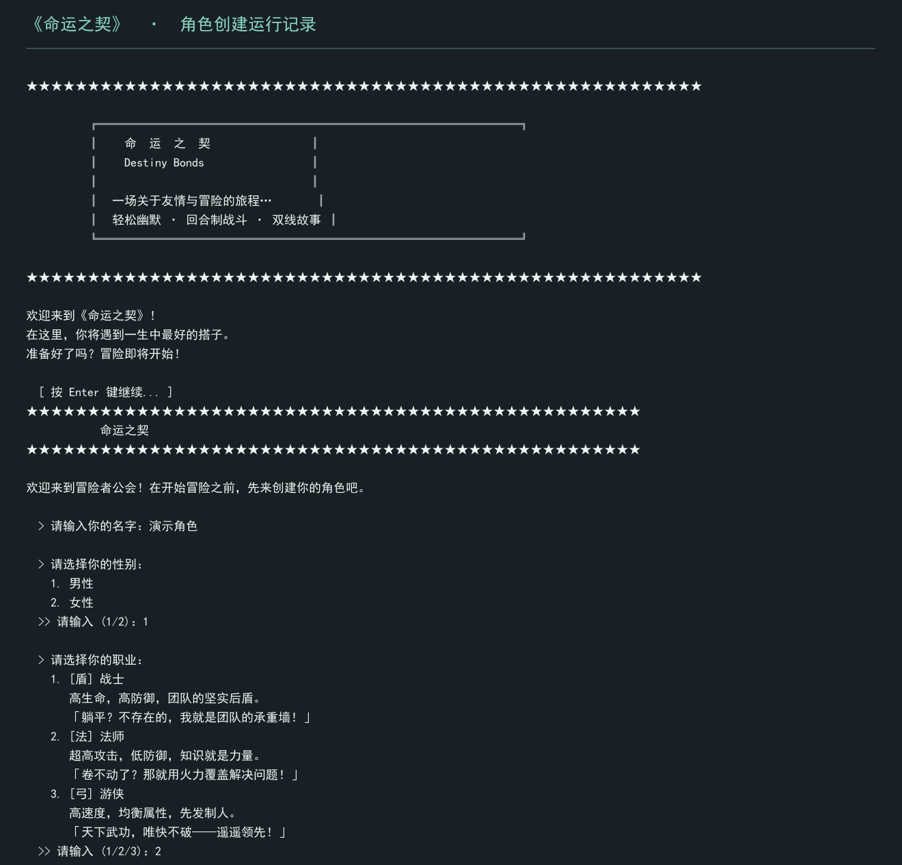

# 《命运之契》：Python 文字 RPG

这是一个在终端运行的回合制文字游戏。可以先创建角色、选择职业，再按提示阅读故事和做决定。仓库主程序包含角色、对话、战斗、背包与商店等代码；详细设定见 [游戏介绍](游戏介绍.md)。



*图：运行主程序采集的开局与角色创建输出，演示输入为“演示角色／男性／法师”；为便于阅读转制成图片。这不是图形游戏界面，也不代表后续所有章节均已测试。*

## 运行

在支持 Python 的终端中运行：

```bash
python destiny_bonds_rpg.py
```

游戏通过文字提示接收输入。主程序使用 Python 标准库；开局与角色创建输出已在 Windows 的 Python 3.12 环境验证，完整流程和其他平台仍需测试。

## 文件

| 路径 | 当前内容 |
| --- | --- |
| `destiny_bonds_rpg.py` | 《命运之契》主程序 |
| `2025_RPG_game_play01.py`、`2025_RPG_game_play02(進階).py` | 较早的 RPG 练习程序 |
| `游戏介绍.md`、`《命运之契》— 游戏介绍.md` | 游戏设定与实现说明 |
| [`docs/game-start-output.png`](docs/game-start-output.png) | 实际开局输出的文字转制图 |
| `海报.jpeg`、`海报2.jpeg` | 宣传概念图，不是程序运行截图 |

项目介绍文档列有莫欣睿、林俊宇、梅骏鴻三名团队成员，但没有记录每人的代码、剧情或美术分工。这里展示的是团队作品与可核查的文件；若用于个人履历，应先补逐人分工。现有海报中的年份与项目说明中的年份并不完全一致，引用时应核对。下一步可补带真实输入的简短试玩视频或战斗画面。
